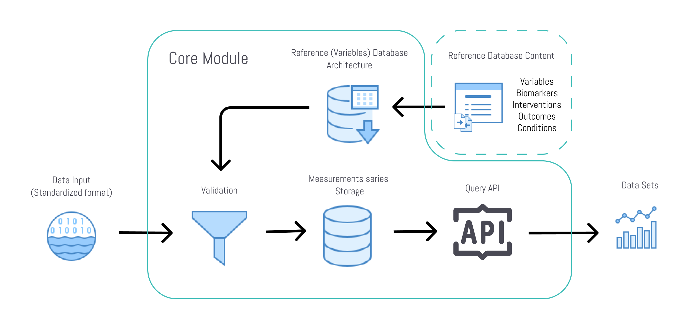

# The Unified Health API
The Unified Health API is the core module of our health data software infrastructure. The main purpose is to provide a single storage and query solution for the analysis of health data.

- It integrates the most used health data standards into a single reference database
- It fills the gaps of not-standardized health data with own references
- It provides our database design for a standardized health data storage solution
- It includes the validation of incoming data against the references
- It specifies the API to query the aggregated health data



## Data Validation
In order to ensure a level of quality required by healthcare and clinical trials, data quality and consistency must be ensured. The data validation middleware will validate the data before it is stored in the time-series database.
Validation involves the following steps:
- Ensure values are within allowed ranges for a variable and unit
- Outlier detection
- Strict data type checking for all properties
Invalid Data Handling:
- Data deviating from allowed value ranges will be flagged for review and deletion or correction
- Outliers will be be flagged
- Invalid data types will be ignored and the data ingestion plugin developer will be notified
- Duplicate data for a given timestamp will be ignored and the data ingestion plugin developer will be notified

## Data Storage
The typical storage for data analysis is a value and a timestamp and is called a measurement. This module includes the storage schema and the interacting functions to spin up an agnostic measurements storage solution.

## Data API
The API lets you interact with the normalized data from your applications to get specific, filtered, sorted, grouped data sets for your use case.

## Reference Database
For the purpose of effective data analysis we put all health data references into a single table and call them variables.
The variables are:

- Biomarkers
- Outcomes
- Conditions
- Interventions

The actual content of this pack of references is managed in this repository: [cure-dao/health-reference-data](https://github.com/cure-dao/health-reference-data)

# Work in Progress

This repo is not yet production ready.  In the short term, you can use our current [API here](https://app.curedao.org/docs).

# Recommended Dev Environment
- Windows: https://laragon.org
- Mac: https://laravel.com/docs/9.x/sail

# Run Locally

1. Copy .env.example to .env.
2. Run `composer install`
3. Run `npm run development`
4. Run `php artisan serve`

# Create an admin user

After logging in, you can make yourself an admin user by running the following command:

`php artisan voyager:admin your@email.com`

Then you'll be able to access the admin panel at `/admin`

# Authentication

You should enable the `withCredentials` option on your application's global axios instance or perform the equivalent configuration on your own HTTP client:

`axios.defaults.withCredentials = true;`

## CSRF Protection
To authenticate your SPA, your SPA's "login" page should first make a request to the `/sanctum/csrf-cookie` endpoint to initialize CSRF protection for the application:

```
axios.get('/sanctum/csrf-cookie').then(response => {
    // Login...
});
```
During this request, the API will set an XSRF-TOKEN cookie containing the current CSRF token. This token should then be 
passed in an X-XSRF-TOKEN header on subsequent requests, which some HTTP client libraries like Axios and the Angular HttpClient will do automatically for you. If your JavaScript HTTP library does not set the value for you, you will need to manually set the X-XSRF-TOKEN header to match the value of the XSRF-TOKEN cookie that is set by this route.

## Logging In
Once CSRF protection has been initialized, you should make a POST request to `/login`. 

If the login request is successful, you will be authenticated and subsequent requests will automatically be authenticated via the session cookie that the application issued to your client. In addition, since your application already made a request to the `/sanctum/csrf-cookie` route, subsequent requests should automatically receive CSRF protection as long as your JavaScript HTTP client sends the value of the `XSRF-TOKEN` cookie in the `X-XSRF-TOKEN` header.

Of course, if your user's session expires due to lack of activity, subsequent requests to the application may receive 401 or 419 HTTP error response. In this case, you should redirect the user to your SPA's login page.

# Authorizing Private Broadcast Channels

In order for Pusher's authorization requests to succeed, you will need to provide a custom Pusher authorizer

```javascript

window.Echo = new Echo({
    broadcaster: "pusher",
    cluster: process.env.MIX_PUSHER_APP_CLUSTER,
    encrypted: true,
    key: process.env.MIX_PUSHER_APP_KEY,
    authorizer: (channel, options) => {
        return {
            authorize: (socketId, callback) => {
                axios.post('/api/broadcasting/auth', {
                    socket_id: socketId,
                    channel_name: channel.name
                })
                .then(response => {
                    callback(false, response.data);
                })
                .catch(error => {
                    callback(true, error);
                });
            }
        };
    },
})
```

# Mobile Application Authentication

Make a post request to `/sanctum/token` with the following body:
```
'email' => 'required|email',
'password' => 'required',
'device_name' => 'required',
```

Pass the returned token in the `Authorization` header as a `Bearer YOUR_TOKEN` in subsequent requests.

